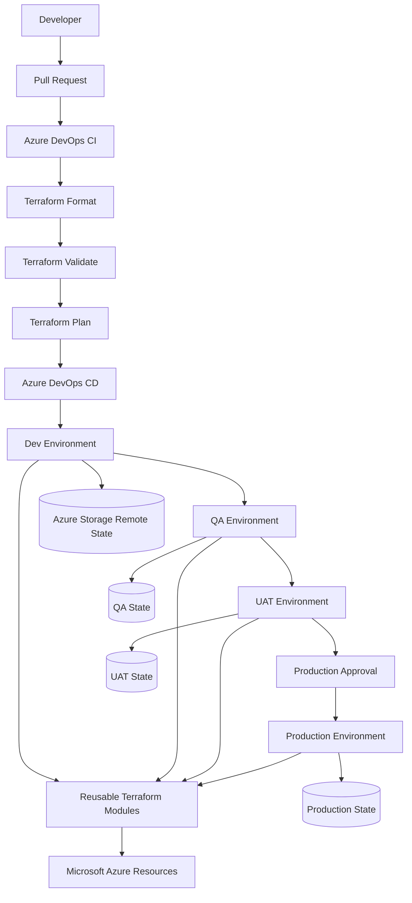

<div align="center">

# ☁️ Azure Landing Zone – Monolithic Application

### Enterprise-style Azure Infrastructure as Code with Terraform + Azure DevOps

<p>
  
  
  
  
  
</p>

<p>
  <b>Reusable modules</b> • <b>Environment isolation</b> • <b>Remote state</b> • <b>CI/CD</b> • <b>Production controls</b>
</p>

</div>

---

## 📌 Project Overview

This repository demonstrates how to build and manage a **multi-environment Azure infrastructure platform** using Terraform and Azure DevOps.

The project follows an enterprise-style layout with reusable Terraform modules, isolated environment configurations, Azure Storage-based remote state, pull-request validation, deployment pipelines, and production approval controls.

### 🎯 Goals

- Build repeatable Azure infrastructure with Terraform
- Separate Dev, QA, UAT, and Production environments
- Reuse infrastructure modules instead of duplicating resource definitions
- Store Terraform state remotely in Azure Storage
- Validate infrastructure changes through CI
- Deploy infrastructure through Azure DevOps CD
- Keep credentials and secrets outside Git
- Apply stronger controls to production changes

---

## 🏗️ Visual Architecture



> GitHub renders Mermaid diagrams directly in Markdown. The diagram above shows the intended Infrastructure-as-Code and promotion flow.

---

## 🧩 Repository Architecture

```text
azure-landing-zone-monolithic-app/
│
├── .github/
│   ├── CODEOWNERS
│   └── pull_request_template.md
│
├── azure-pipelines/
│   ├── terraform-ci.yml
│   └── terraform-cd.yml
│
├── environments/
│   ├── dev/
│   ├── qa/
│   ├── uat/
│   └── prod/
│
├── modules/
│   ├── azurerm_application_gateway/
│   ├── azurerm_resource_group/
│   ├── azurerm_storage_account/
│   ├── azurerm_virtual_network/
│   ├── azurerm_subnet/
│   └── ...
│
├── docs/
│   ├── Architecture.png
│   ├── Flow.md
│   ├── HLD.md
│   └── LLD.md
│
└── .gitignore
```

---

## ☁️ Azure / Terraform Design

| Layer | Implementation |
|---|---|
| Cloud | Microsoft Azure |
| IaC | Terraform |
| Provider | AzureRM `4.80.0` |
| Environments | Dev / QA / UAT / Prod |
| State | Azure Storage backend |
| CI | Azure DevOps Pipelines |
| CD | Azure DevOps multi-stage pipeline |
| Authentication | Azure CLI / Azure DevOps Service Connection |
| Security | RBAC, secret variables, approvals, branch controls |
| Modules | Reusable AzureRM modules |

### Current infrastructure building blocks

- Azure Resource Groups
- Azure Storage Account
- Blob Container for Terraform state
- Azure Virtual Network
- Azure Subnet
- Application Gateway module foundation
- Additional reusable Azure resource modules under `modules/`

---

## 🔄 Terraform Workflow

```text
Developer
   │
   ▼
Feature Branch
   │
   ▼
Pull Request
   │
   ▼
┌─────────────────────────┐
│ Azure DevOps CI         │
│                         │
│ terraform fmt -check    │
│ terraform init          │
│ terraform validate      │
└────────────┬────────────┘
             │
             ▼
       Terraform Plan
             │
             ▼
       Review / Approval
             │
             ▼
       Terraform Apply
             │
             ▼
       Azure Resources
```

---

## 🚀 CI/CD Pipeline

### CI – Pull Request Validation

The CI pipeline runs on pull requests targeting `main` and validates the Dev Terraform configuration using:

```bash
terraform fmt -check -recursive
terraform init -backend=false
terraform validate
```

This catches formatting and configuration errors before infrastructure changes are merged.

### CD – Deployment

The CD pipeline performs:

```text
main
 │
 ▼
Plan Dev
 │
 ▼
Apply Dev
 │
 ▼
QA / UAT promotion
 │
 ▼
Production approval
 │
 ▼
Production deployment
```

The current pipeline intentionally keeps QA/UAT/Production promotion gated until their environment-specific configuration and Azure DevOps approvals are configured.

---

## 🔐 Security & Governance

Security is treated as part of the infrastructure workflow rather than an afterthought.

### Implemented repository controls

- No hard-coded Azure subscription ID in the provider configuration
- Azure authentication through CLI/service connection
- Secrets should be supplied through Azure DevOps secret variables or secure identity mechanisms
- Terraform state and plan files are ignored by Git
- CODEOWNERS added for infrastructure review
- Pull request security checklist added
- Production changes are designed around protected Azure DevOps environments
- Least-privilege RBAC is recommended

### 🚫 Never commit

```text
*.tfstate
*.tfplan
*.auto.tfvars
passwords
client secrets
certificates
service-principal credentials
```

---

## 🌍 Environment Strategy

| Environment | Purpose | State | Deployment control |
|---|---|---|---|
| 🟢 Dev | Development and testing | Isolated Azure backend key | Automatic after successful pipeline flow |
| 🔵 QA | Functional validation | Dedicated backend key | Controlled promotion |
| 🟣 UAT | Business/user acceptance | Dedicated backend key | Controlled promotion |
| 🔴 Prod | Production workload | Dedicated backend key | Manual approval/checks |

Each environment has its own Terraform working directory so state and configuration can be isolated.

> **Important:** QA, UAT, and Prod are currently environment scaffolds. Their Azure backend resources and environment-specific infrastructure must exist/configure correctly before those pipelines are used for real deployments.

---

## 🗄️ Remote State

Terraform uses the AzureRM backend pattern so state can be stored centrally in Azure Storage instead of on a developer workstation.

Example Dev state configuration:

```hcl
backend "azurerm" {
  resource_group_name  = "dev-infra"
  storage_account_name = "devinfrastorage042026"
  container_name       = "devcontainer"
  key                  = "terraformdev.tfstate"
}
```

Production should use a separately protected state store with restricted access, locking, backup/retention controls, and appropriate RBAC.

---

## 🧱 Reusable Module Pattern

Environment configuration stays small while Azure resource logic lives inside reusable modules:

```text
environments/dev/main.tf
        │
        ├──────────────► modules/azurerm_resource_group
        │
        ├──────────────► modules/azurerm_storage_account
        │
        ├──────────────► modules/azurerm_virtual_network
        │
        └──────────────► modules/azurerm_subnet
```

This pattern makes the same infrastructure components reusable across Dev, QA, UAT, and Production without copying resource implementations.

---

## 📚 Documentation

Detailed design documentation is maintained under `docs/`:

- **Architecture** – high-level platform structure
- **HLD** – High-Level Design
- **LLD** – Low-Level Design
- **Flow** – infrastructure/deployment flow

---

## 🧪 Local Validation

Run Terraform from an environment directory:

```bash
cd environments/dev
terraform init
terraform fmt -recursive
terraform validate
terraform plan
```

For CI-style validation without accessing the remote backend:

```bash
terraform fmt -check -recursive
terraform init -backend=false
terraform validate
```

---

## 📋 Engineering Checklist

- [x] Reusable Terraform modules
- [x] Environment separation
- [x] AzureRM provider pinning
- [x] Remote-state pattern
- [x] Azure DevOps CI pipeline
- [x] Azure DevOps CD foundation
- [x] CODEOWNERS
- [x] Pull request template
- [x] Terraform/local `.gitignore`
- [x] Subscription ID removed from provider code
- [x] Visual Mermaid architecture
- [x] HLD / LLD / Flow documentation
- [ ] Complete QA deployment
- [ ] Complete UAT deployment
- [ ] Complete production deployment
- [ ] Production-grade state storage and access controls
- [ ] Checkov/tfsec security scanning
- [ ] Azure Policy / policy-as-code
- [ ] OIDC / workload identity for CI/CD
- [ ] Diagnostic settings and centralized monitoring

---

## 🎤 Interview Talking Points

This project can be explained in an interview as:

> **“I designed a modular Azure Landing Zone-style Terraform repository with isolated Dev, QA, UAT and Production environments. Terraform state is separated through Azure Storage backends, reusable modules keep infrastructure DRY, and Azure DevOps handles PR validation and deployment. Security is enforced by keeping credentials out of Git, using Azure service connections/RBAC, and protecting production through approvals and branch controls.”**

### Key topics demonstrated

- Terraform modules and variables
- AzureRM provider and remote state
- Infrastructure environment isolation
- Azure networking fundamentals
- Azure DevOps CI/CD
- Terraform plan/apply lifecycle
- RBAC and secret management
- Production governance
- Infrastructure documentation

---

## 🛣️ Roadmap

### Phase 1 – Foundation

- [x] Terraform modules
- [x] Environment structure
- [x] Remote-state pattern
- [x] CI validation
- [x] CD foundation

### Phase 2 – Security

- [ ] Checkov security scanning
- [ ] Azure Policy
- [ ] OIDC/workload identity
- [ ] Private Endpoints
- [ ] Private DNS

### Phase 3 – Enterprise Operations

- [ ] Diagnostic settings
- [ ] Centralized Log Analytics
- [ ] Azure Monitor alerts
- [ ] Cost management controls
- [ ] Backup/DR strategy

### Phase 4 – Production

- [ ] Complete Prod configuration
- [ ] Protected production environment
- [ ] Approval/check policies
- [ ] Disaster recovery testing
- [ ] Full release promotion Dev → QA → UAT → Prod

---

## ⭐ Why This Repository?

This project is intentionally structured to demonstrate more than simply creating Azure resources. It focuses on **how infrastructure is engineered, reviewed, promoted, secured, and maintained across environments**.

**Azure + Terraform + Azure DevOps + Modular IaC + Governance = Enterprise-style Infrastructure Engineering**

---

<div align="center">

### Built with ☁️ Azure • 🏗️ Terraform • 🔄 Azure DevOps

</div>
